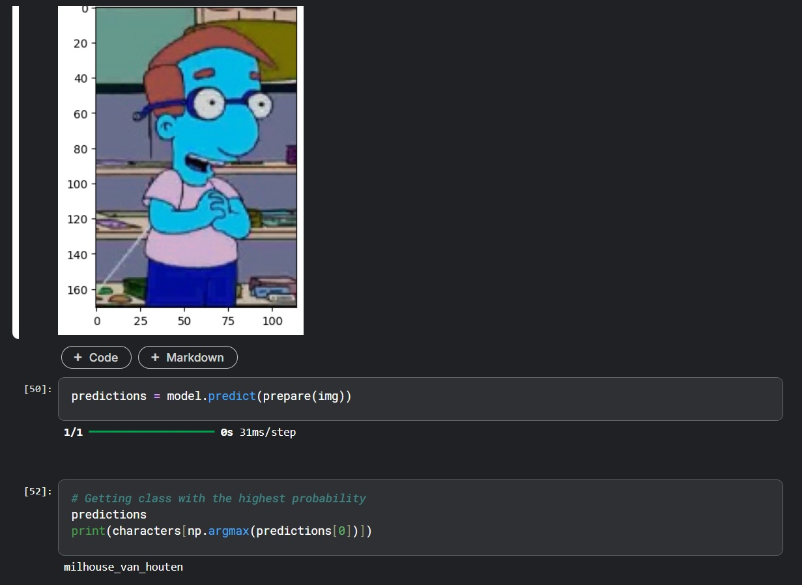

# 🧠 Simpsons Character Classifier – Deep Learning from Scratch



> A complete end-to-end computer vision project that recognizes *The Simpsons* characters using a deep Convolutional Neural Network (CNN) trained from scratch.  
> Powered by TensorFlow/Keras and fueled by a high-quality dataset from Kaggle, this project demonstrates robust image classification capabilities with real-world applications in animation, media analytics, and beyond.

---

## 📦 Dataset Source

This project uses the **official Simpsons Characters Dataset** from Kaggle:  
📌 [The Simpsons Characters Dataset (by Alex Attia)](https://www.kaggle.com/datasets/alexattia/the-simpsons-characters-dataset)

- ✅ Over **20,000 labeled images** from episodes of *The Simpsons*
- ✅ Each image contains **one of 50+ characters**
- ✅ We filtered and trained on the **top 10 most frequent characters** to ensure balanced learning

---

## 🚀 What This Project Does

This notebook implements a full **deep learning pipeline**:

1. 🔍 **Loads real-world noisy image data**
2. 🧼 **Preprocesses** grayscale images and normalizes inputs
3. 🧠 Builds a **multi-layered CNN architecture** from scratch
4. 🏋️ Trains the model using **data generators** and **learning rate schedulers**
5. 📊 Validates and tests performance on real episode screenshots
6. 📸 Performs real-time prediction with sample output images

---

## 🧰 Technologies Used

| Tool              | Purpose                              |
|-------------------|--------------------------------------|
| `TensorFlow` / `Keras` | Deep learning model and training      |
| `OpenCV`           | Image processing and visualization   |
| `Caer`, `Canaro`   | Data loading, augmentation, and training utilities |
| `NumPy`, `Matplotlib` | Data manipulation and plotting      |

---

## 🧱 Model Architecture

```text
Input: 80x80 grayscale image

[Conv2D → ReLU → Conv2D → ReLU → MaxPooling → Dropout] × 3
→ Flatten → Dropout → Dense(1024, ReLU) → Dense(10, Softmax)

```
## 📚 Notebook

[]
(https://colab.research.google.com/github/Sravan2804/Simpsons-Character-Classifier/blob/main/simpsons-classifier.ipynb)

> ⚠️ This notebook uses a Kaggle dataset. To run it on Colab:
> 
> 1. Upload the dataset manually or use `kaggle.json` API key.
> 2. Uncomment and run the following in the first cell:
> 
> ```python
> !pip install -q kaggle
> from google.colab import files
> files.upload()  # Upload kaggle.json here
> 
> !mkdir ~/.kaggle
> !cp kaggle.json ~/.kaggle/
> !chmod 600 ~/.kaggle/kaggle.json
> 
> !kaggle datasets download -d alexattia/the-simpsons-characters-dataset
> !unzip the-simpsons-characters-dataset.zip -d ./data
> ```


